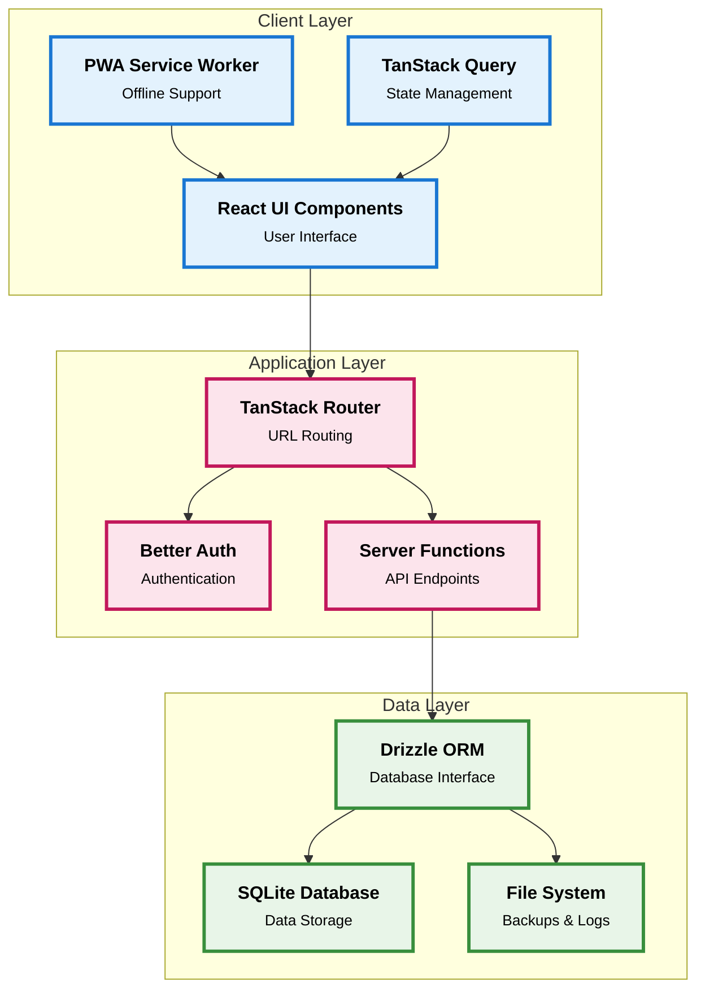
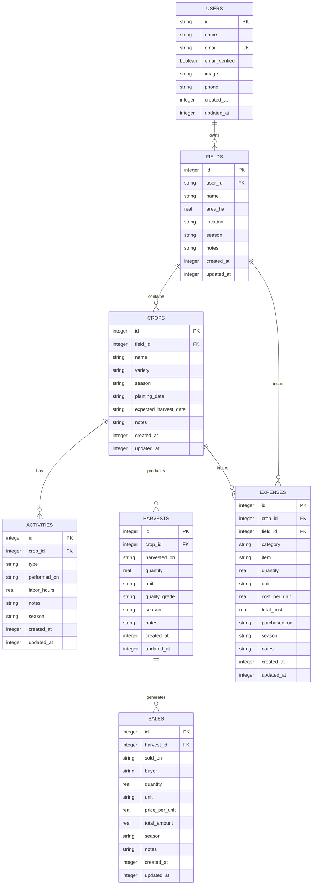
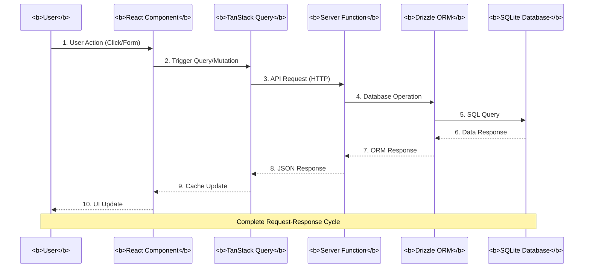
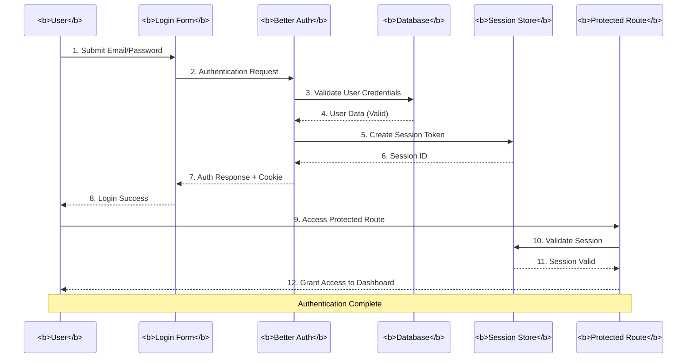
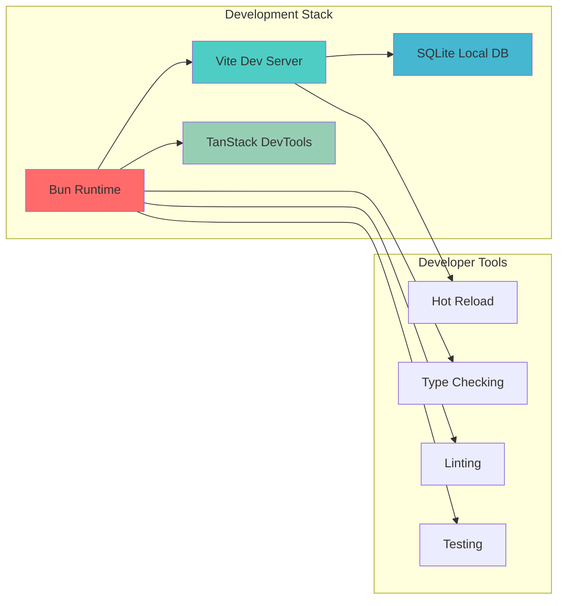
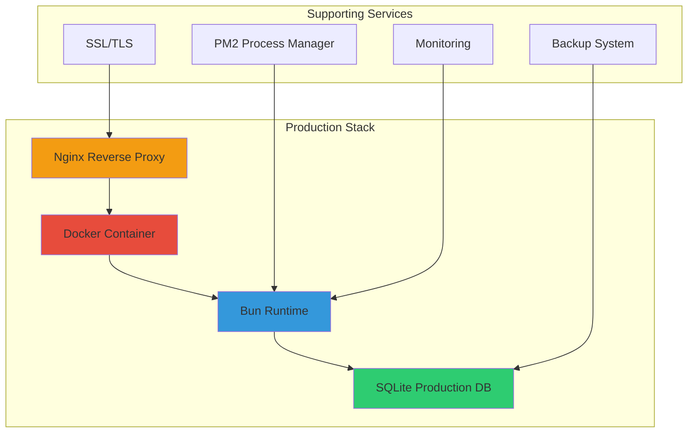
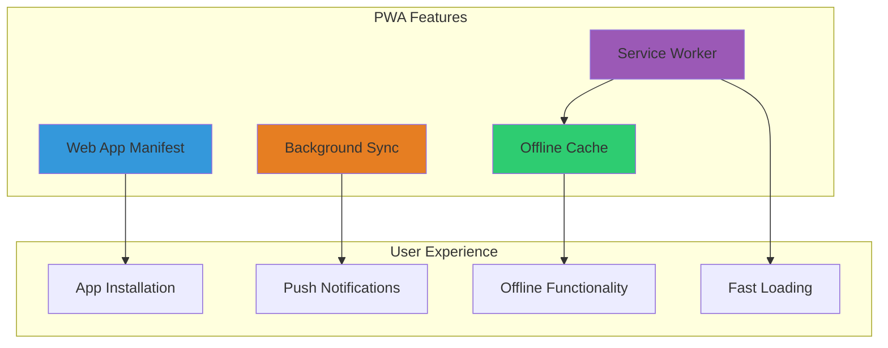

# System Design Document

## Farm Assist - Agricultural Management System

**Version:** 1.0  
**Date:** December 2025  
**Author:** Final Year Project Team

---

## 1. Introduction

### 1.1 Purpose

This document provides a comprehensive system design for Farm Assist, detailing the architecture, components, data models, and technical specifications required to implement the agricultural management system.

### 1.2 System Overview

Farm Assist is a Progressive Web Application (PWA) built on a full-stack React architecture, designed to provide smallholder farmers with digital tools for managing their agricultural operations, tracking finances, and analyzing farm performance.

---

## 2. System Architecture

### 2.1 High-Level Architecture



### 2.2 Component Architecture

#### 2.2.1 Frontend Components

```
src/
├── components/
│   ├── ui/                    # Reusable UI components (shadcn/ui)
│   │   ├── button.tsx
│   │   ├── card.tsx
│   │   ├── dialog.tsx
│   │   └── ...
│   ├── app-sidebar.tsx       # Navigation sidebar
│   └── logo.tsx              # Application branding
├── routes/                    # Page components and routing
│   ├── dashboard/
│   │   ├── index.tsx         # Dashboard overview
│   │   ├── fields.tsx        # Field management
│   │   ├── crops.tsx         # Crop management
│   │   ├── expenses.tsx      # Expense tracking
│   │   ├── harvests.tsx       # Harvest recording
│   │   ├── sales.tsx          # Sales management
│   │   └── reports.tsx        # Financial reports
│   ├── sign-in.tsx           # Authentication page
│   └── index.tsx             # Landing page
├── hooks/                     # Custom React hooks
│   └── use-mobile.ts         # Mobile detection
├── lib/                       # Core libraries
│   ├── auth.ts               # Authentication configuration
│   ├── auth-client.ts        # Client-side auth utilities
│   └── utils.ts              # Shared utility functions
└── utils/                     # Business logic utilities
    ├── dashboard.ts          # Dashboard data aggregation
    ├── fields.ts             # Field operations
    ├── crops.ts              # Crop operations
    ├── expenses.ts           # Expense operations
    ├── harvests.ts           # Harvest operations
    ├── sales.ts              # Sales operations
    ├── reports.ts            # Report generation
    └── format.ts             # Data formatting utilities
```

#### 2.2.2 Backend Components

```
src/
├── db/
│   ├── index.ts              # Database connection
│   ├── migrate.ts            # Migration runner
│   └── schema.ts             # Database schema definitions
├── middleware/
│   └── auth.ts               # Authentication middleware
├── routes/api/
│   └── auth/$.ts             # Authentication API endpoints
└── integrations/
    └── tanstack-query/
        ├── devtools.tsx      # Query dev tools
        └── root-provider.tsx # Query client provider
```

---

## 3. Data Model Design

### 3.1 Database Schema

#### 3.1.1 Authentication Tables

```sql
-- Users Table
CREATE TABLE users (
    id TEXT PRIMARY KEY,
    name TEXT NOT NULL,
    email TEXT NOT NULL UNIQUE,
    email_verified BOOLEAN NOT NULL DEFAULT FALSE,
    image TEXT,
    phone TEXT,
    created_at INTEGER DEFAULT (unixepoch()),
    updated_at INTEGER DEFAULT (unixepoch())
);

-- Sessions Table
CREATE TABLE sessions (
    id TEXT PRIMARY KEY,
    expires_at INTEGER NOT NULL,
    token TEXT NOT NULL UNIQUE,
    ip_address TEXT,
    user_agent TEXT,
    user_id TEXT NOT NULL REFERENCES users(id) ON DELETE CASCADE,
    created_at INTEGER DEFAULT (unixepoch()),
    updated_at INTEGER DEFAULT (unixepoch())
);

-- Accounts Table (for OAuth providers)
CREATE TABLE accounts (
    id TEXT PRIMARY KEY,
    account_id TEXT NOT NULL,
    provider_id TEXT NOT NULL,
    user_id TEXT NOT NULL REFERENCES users(id) ON DELETE CASCADE,
    access_token TEXT,
    refresh_token TEXT,
    id_token TEXT,
    access_token_expires_at INTEGER,
    refresh_token_expires_at INTEGER,
    scope TEXT,
    password TEXT,
    created_at INTEGER DEFAULT (unixepoch()),
    updated_at INTEGER DEFAULT (unixepoch())
);
```

#### 3.1.2 Farm Management Tables

```sql
-- Fields Table
CREATE TABLE fields (
    id INTEGER PRIMARY KEY AUTOINCREMENT,
    user_id TEXT REFERENCES users(id) ON DELETE SET NULL,
    name TEXT NOT NULL,
    area_ha REAL,
    location TEXT,
    season TEXT NOT NULL,
    notes TEXT,
    created_at INTEGER DEFAULT (unixepoch()),
    updated_at INTEGER DEFAULT (unixepoch())
);

-- Crops Table
CREATE TABLE crops (
    id INTEGER PRIMARY KEY AUTOINCREMENT,
    field_id INTEGER NOT NULL REFERENCES fields(id) ON DELETE CASCADE,
    name TEXT NOT NULL,
    variety TEXT,
    season TEXT NOT NULL,
    planting_date TEXT,
    expected_harvest_date TEXT,
    notes TEXT,
    created_at INTEGER DEFAULT (unixepoch()),
    updated_at INTEGER DEFAULT (unixepoch())
);

-- Activities Table (for farming operations)
CREATE TABLE activities (
    id INTEGER PRIMARY KEY AUTOINCREMENT,
    crop_id INTEGER NOT NULL REFERENCES crops(id) ON DELETE CASCADE,
    type TEXT NOT NULL,
    performed_on TEXT NOT NULL,
    labor_hours REAL,
    notes TEXT,
    season TEXT NOT NULL,
    created_at INTEGER DEFAULT (unixepoch()),
    updated_at INTEGER DEFAULT (unixepoch())
);

-- Expenses Table
CREATE TABLE expenses (
    id INTEGER PRIMARY KEY AUTOINCREMENT,
    crop_id INTEGER REFERENCES crops(id) ON DELETE SET NULL,
    field_id INTEGER REFERENCES fields(id) ON DELETE SET NULL,
    category TEXT NOT NULL,
    item TEXT NOT NULL,
    quantity REAL,
    unit TEXT,
    cost_per_unit REAL,
    total_cost REAL NOT NULL,
    purchased_on TEXT NOT NULL,
    season TEXT NOT NULL,
    notes TEXT,
    created_at INTEGER DEFAULT (unixepoch()),
    updated_at INTEGER DEFAULT (unixepoch())
);

-- Harvests Table
CREATE TABLE harvests (
    id INTEGER PRIMARY KEY AUTOINCREMENT,
    crop_id INTEGER NOT NULL REFERENCES crops(id) ON DELETE CASCADE,
    harvested_on TEXT NOT NULL,
    quantity REAL NOT NULL,
    unit TEXT NOT NULL,
    quality_grade TEXT,
    season TEXT NOT NULL,
    notes TEXT,
    created_at INTEGER DEFAULT (unixepoch()),
    updated_at INTEGER DEFAULT (unixepoch())
);

-- Sales Table
CREATE TABLE sales (
    id INTEGER PRIMARY KEY AUTOINCREMENT,
    harvest_id INTEGER NOT NULL REFERENCES harvests(id) ON DELETE CASCADE,
    sold_on TEXT NOT NULL,
    buyer TEXT,
    quantity REAL NOT NULL,
    unit TEXT NOT NULL,
    price_per_unit REAL NOT NULL,
    total_amount REAL NOT NULL,
    season TEXT NOT NULL,
    notes TEXT,
    created_at INTEGER DEFAULT (unixepoch()),
    updated_at INTEGER DEFAULT (unixepoch())
);
```

### 3.2 Entity Relationship Diagram



### 3.3 Data Flow Architecture

#### 3.3.1 Request Flow



#### 3.3.2 Authentication Flow



---

## 4. Component Design Specifications

### 4.1 UI Component Library (shadcn/ui)

#### 4.1.1 Core Components

- **Button**: Interactive actions with variants (primary, secondary, destructive)
- **Card**: Content containers with header and body sections
- **Dialog**: Modal dialogs for forms and confirmations
- **Input**: Form inputs with validation states
- **Table**: Data tables with sorting and pagination
- **Select**: Dropdown selection components
- **Alert Dialog**: Confirmation dialogs for destructive actions

#### 4.1.2 Layout Components

- **Sidebar**: Navigation with menu items and user profile
- **Separator**: Visual dividers between content sections
- **Skeleton**: Loading state placeholders
- **Tooltip**: Contextual help and information

### 4.2 Page Component Architecture

#### 4.2.1 Dashboard Component

```typescript
// Dashboard data aggregation
interface DashboardStats {
  fieldCount: number
  cropCount: number
  harvestCount: number
  totalExpenses: number
  totalRevenue: number
  profit: number
}

// Component responsibilities:
// - Fetch aggregated statistics
// - Display metric cards
// - Show profit/loss indicators
// - Responsive grid layout
```

#### 4.2.2 Fields Management Component

```typescript
// Field data structure
interface Field {
  id: number
  name: string
  areaHa?: number
  location?: string
  season: string
  notes?: string
  createdAt: Date
  updatedAt: Date
}

// Component responsibilities:
// - CRUD operations for fields
// - Form validation and submission
// - Delete confirmation dialogs
// - Empty state handling
```

#### 4.2.3 Expenses Component

```typescript
// Expense data structure
interface Expense {
  id: number
  cropId?: number
  fieldId?: number
  category: string
  item: string
  quantity?: number
  unit?: string
  costPerUnit?: number
  totalCost: number
  purchasedOn: string
  season: string
  notes?: string
  createdAt: Date
  updatedAt: Date
}

// Component responsibilities:
// - Expense entry forms with category selection
// - Table view with sorting and filtering
// - Category-based visual indicators
// - Total expense calculations
```

---

## 5. API Design

### 5.1 Server Functions Architecture

#### 5.1.1 Query Functions

```typescript
// Dashboard statistics
export const getStats = createServerFn({ method: 'GET' }).handler(async () => {
  const [stats] = await db
    .select({
      fieldCount: sql<number>`(select count(*) from ${fields})`,
      cropCount: sql<number>`(select count(*) from ${crops})`,
      harvestCount: sql<number>`(select count(*) from ${harvests})`,
      totalExpenses: sql<number>`(select coalesce(sum(${expenses.totalCost}), 0) from ${expenses})`,
      totalRevenue: sql<number>`(select coalesce(sum(${sales.totalAmount}), 0) from ${sales})`,
    })
    .from(sql`(select 1)`)

  return {
    fieldCount: stats?.fieldCount ?? 0,
    cropCount: stats?.cropCount ?? 0,
    harvestCount: stats?.harvestCount ?? 0,
    totalExpenses: stats?.totalExpenses ?? 0,
    totalRevenue: stats?.totalRevenue ?? 0,
    profit: (stats?.totalRevenue ?? 0) - (stats?.totalExpenses ?? 0),
  }
})
```

#### 5.1.2 Mutation Functions

```typescript
// Field creation
export const addField = createServerFn({ method: 'POST' })
  .validator(
    z.object({
      name: z.string().min(1),
      areaHa: z.number().optional(),
      location: z.string().optional(),
      season: z.string().min(1),
      notes: z.string().optional(),
    }),
  )
  .handler(async ({ data }) => {
    const [field] = await db.insert(fields).values(data).returning()
    return field
  })
```

### 5.2 Query Options Pattern

```typescript
// TanStack Query integration
export const statsQueryOptions = () =>
  queryOptions({
    queryKey: ['stats'],
    queryFn: () => getStats(),
  })

export const fieldsQueryOptions = () =>
  queryOptions({
    queryKey: ['fields'],
    queryFn: () => getFields(),
  })
```

---

## 6. Security Design

### 6.1 Authentication Architecture

#### 6.1.1 Better Auth Configuration

```typescript
export const auth = betterAuth({
  emailAndPassword: {
    enabled: true,
  },
  database: drizzleAdapter(db, {
    provider: 'sqlite',
    usePlural: true,
  }),
  baseURL: process.env.BETTER_AUTH_URL ?? 'http://localhost:3000',
  plugins: [tanstackStartCookies()],
})
```

#### 6.1.2 Session Management

- Secure HTTP-only cookies for session tokens
- Automatic session refresh on activity
- Session expiration after 24 hours inactivity
- Cross-site request forgery (CSRF) protection

### 6.2 Data Protection

#### 6.2.1 Input Validation

- Zod schema validation for all inputs
- SQL injection prevention through parameterized queries
- XSS protection through React's built-in escaping
- Content Security Policy (CSP) headers

#### 6.2.2 Authorization

- User-scoped data queries
- Tenant isolation in database operations
- Route-level protection through middleware
- Client-side route guards

---

## 7. Performance Design

### 7.1 Caching Strategy

#### 7.1.1 TanStack Query Caching

- Automatic caching of API responses
- Stale-while-revalidate pattern
- Background refetching on window focus
- Optimistic updates for better UX

#### 7.1.2 PWA Caching

- Service worker for static asset caching
- Runtime caching for API responses
- Offline-first approach for core features
- Cache invalidation strategies

### 7.2 Database Optimization

#### 7.2.1 Index Strategy

```sql
-- Performance indexes
CREATE INDEX fields_user_season_idx ON fields(user_id, season);
CREATE INDEX crops_field_season_idx ON crops(field_id, season);
CREATE INDEX activities_crop_date_idx ON activities(crop_id, performed_on);
CREATE INDEX expenses_crop_field_date_idx ON expenses(crop_id, field_id, purchased_on);
CREATE INDEX harvests_crop_date_idx ON harvests(crop_id, harvested_on);
CREATE INDEX sales_harvest_date_idx ON sales(harvest_id, sold_on);
```

#### 7.2.2 Query Optimization

- Efficient aggregate queries for dashboard
- Join optimization for related data
- Pagination for large datasets
- Connection pooling for concurrent requests

---

## 8. Deployment Architecture

### 8.1 Development Environment



### 8.2 Production Environment



### 8.3 PWA Deployment



---

## 9. Technology Stack Details

### 9.1 Frontend Technologies

- **React 19**: UI framework with concurrent features
- **TypeScript**: Type-safe JavaScript development
- **TanStack Router**: File-based routing with SSR
- **TanStack Query**: Server state management
- **Tailwind CSS**: Utility-first CSS framework
- **shadcn/ui**: Component library built on Radix UI

### 9.2 Backend Technologies

- **TanStack Start**: Full-stack React framework
- **Better Auth**: Authentication solution
- **Drizzle ORM**: Type-safe database operations
- **SQLite**: Lightweight database engine
- **Bun**: High-performance JavaScript runtime

### 9.3 Development Tools

- **Vite**: Fast build tool and dev server
- **ESLint**: Code linting and formatting
- **Prettier**: Code formatting
- **Vitest**: Testing framework
- **Drizzle Kit**: Database migration tool

---

## 10. Design Patterns and Principles

### 10.1 Architectural Patterns

- **Repository Pattern**: Data access abstraction
- **Command Query Responsibility Segregation (CQRS)**: Separate read/write operations
- **Observer Pattern**: Reactive state management
- **Factory Pattern**: Component creation and configuration

### 10.2 Design Principles

- **Single Responsibility**: Each component has one purpose
- **Open/Closed**: Components are extensible but not modifiable
- **Dependency Inversion**: Depend on abstractions, not concretions
- **Don't Repeat Yourself (DRY)**: Reusable components and utilities

### 10.3 Code Organization

- **Feature-based structure**: Group by functionality
- **Shared utilities**: Common business logic
- **Type safety**: Comprehensive TypeScript usage
- **Testing**: Unit and integration test coverage

---

## 11. Future Scalability Considerations

### 11.1 Database Scaling

- Migration path to PostgreSQL for larger datasets
- Read replicas for improved query performance
- Connection pooling for high concurrency
- Data archiving strategies for historical data

### 11.2 Feature Expansion

- Multi-tenancy support for agricultural organizations
- API integration with external agricultural services
- Advanced analytics and machine learning features
- Mobile app development (React Native)

### 11.3 Infrastructure Scaling

- Container orchestration with Kubernetes
- Load balancing for high availability
- CDN integration for static assets
- Monitoring and observability implementation

---

## 12. Design Review and Approval

**Technical Architecture Review:**

- Approved by: \***\*\*\*\*\*\*\***\_\***\*\*\*\*\*\*\***
- Date: \***\*\*\*\*\*\*\***\_\***\*\*\*\*\*\*\***

**Security Design Review:**

- Approved by: \***\*\*\*\*\*\*\***\_\***\*\*\*\*\*\*\***
- Date: \***\*\*\*\*\*\*\***\_\***\*\*\*\*\*\*\***

**Performance Design Review:**

- Approved by: \***\*\*\*\*\*\*\***\_\***\*\*\*\*\*\*\***
- Date: \***\*\*\*\*\*\*\***\_\***\*\*\*\*\*\*\***
