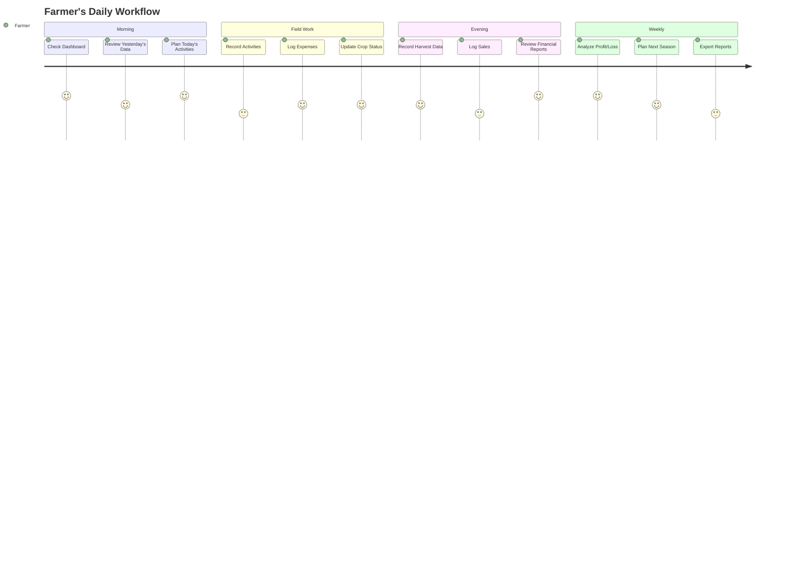

# System Requirements Specification

## Farm Assist - Agricultural Management System

**Version:** 1.0  
**Date:** December 2025  
**Author:** Final Year Project Team

---

## 1. Introduction

### 1.1 Purpose

This document outlines the comprehensive system requirements for Farm Assist, a Progressive Web Application (PWA) designed to help smallholder farmers manage their agricultural operations through digital record-keeping and financial tracking.

### 1.2 Scope

The Farm Assist system provides a complete solution for farm management including:

- Field and crop management
- Expense tracking and categorization
- Harvest recording and yield monitoring
- Sales management and revenue tracking
- Financial reporting and analytics
- User authentication and data security

### 1.3 Target Users

- Smallholder farmers (1-10 hectares)
- Agricultural extension officers
- Farm managers
- Agricultural cooperatives

### User Journey Flow:

---

## 2. Functional Requirements

### 2.1 User Management (FR-UM)

**FR-UM-001: User Registration**

- Users shall be able to create an account using email and password
- System shall validate email format and password strength
- Users shall provide basic profile information (name, phone optional)

**FR-UM-002: User Authentication**

- Users shall be able to log in with registered credentials
- System shall maintain secure session management
- Users shall be able to log out and terminate sessions

**FR-UM-003: Password Management**

- Users shall be able to reset forgotten passwords via email
- System shall enforce password complexity requirements
- Users shall be able to change their password when logged in

### 2.2 Field Management (FR-FM)

**FR-FM-001: Field Creation**

- Users shall be able to add new farm fields
- System shall record field name, area (hectares), location, and season
- Fields shall be associated with user accounts

**FR-FM-002: Field Viewing**

- Users shall be able to view all their fields in a dashboard
- System shall display field details in card format
- Users shall see field count and total area

**FR-FM-003: Field Modification**

- Users shall be able to edit field details
- System shall maintain field history and timestamps
- Users shall be able to delete fields with cascade confirmation

### 2.3 Crop Management (FR-CM)

**FR-CM-001: Crop Registration**

- Users shall be able to register crops for specific fields
- System shall record crop name, variety, planting date, and expected harvest
- Crops shall be linked to parent fields

**FR-CM-002: Crop Tracking**

- Users shall be able to view active crops by field
- System shall display crop growth stages and timelines
- Users shall record agricultural activities for each crop

### 2.4 Expense Management (FR-EM)

**FR-EM-001: Expense Recording**

- Users shall be able to record farm expenses
- System shall support predefined categories (Seeds, Fertilizer, Labor, etc.)
- Expenses shall include amount, date, description, and optional crop linkage

**FR-EM-002: Expense Categorization**

- System shall provide standard expense categories with icons
- Users shall be able to categorize expenses during entry
- System shall track expenses by category for reporting

**FR-EM-003: Expense Viewing**

- Users shall be able to view all expenses in tabular format
- System shall sort expenses by date (newest first)
- Users shall see total expenses and category breakdowns

### 2.5 Harvest Management (FR-HM)

**FR-HM-001: Harvest Recording**

- Users shall be able to record harvest quantities
- System shall record harvest date, quantity, unit, and quality grade
- Harvests shall be linked to specific crops

**FR-HM-002: Yield Tracking**

- System shall calculate yield per hectare automatically
- Users shall be able to compare yields across seasons
- System shall maintain harvest history

### 2.6 Sales Management (FR-SM)

**FR-SM-001: Sales Recording**

- Users shall be able to record sales of harvested produce
- System shall record buyer, quantity, unit price, and total amount
- Sales shall be linked to specific harvests

**FR-SM-002: Revenue Tracking**

- System shall calculate total revenue automatically
- Users shall be able to track sales by buyer and date
- System shall maintain sales history

### 2.7 Reporting and Analytics (FR-RA)

**FR-RA-001: Dashboard Overview**

- Users shall see key metrics on dashboard (fields, crops, expenses, revenue, profit)
- System shall display real-time financial summaries
- Dashboard shall show net profit with color-coded indicators

**FR-RA-002: Financial Reports**

- Users shall be able to view comprehensive financial reports
- System shall show expenses by category with percentages
- Reports shall include recent activity timelines

**FR-RA-003: Profit Analysis**

- System shall calculate net profit (revenue - expenses)
- Users shall see profitability indicators and trends
- Reports shall break down costs and revenue by period

---

## 3. Non-Functional Requirements

### 3.1 Performance Requirements (NFR-P)

**NFR-P-001: Response Time**

- System shall respond to user actions within 2 seconds
- Database queries shall complete within 500ms
- Page loads shall not exceed 3 seconds on 3G networks

**NFR-P-002: Throughput**

- System shall support 100 concurrent users
- Database shall handle 1000 transactions per minute
- API endpoints shall respond within 200ms average

**NFR-P-003: Resource Usage**

- Application shall load within 5MB initial bundle size
- Memory usage shall not exceed 100MB on mobile devices
- Battery impact shall be minimal for background operations

### 3.2 Security Requirements (NFR-S)

**NFR-S-001: Authentication**

- System shall use secure password hashing (bcrypt)
- Sessions shall expire after 24 hours of inactivity
- Multi-factor authentication shall be available optionally

**NFR-S-002: Data Protection**

- All data transmission shall use HTTPS/TLS 1.3
- Database connections shall be encrypted
- User data shall be isolated by tenant ID

**NFR-S-003: Input Validation**

- All user inputs shall be validated and sanitized
- SQL injection protection shall be implemented
- XSS protection shall be enabled for all user content

### 3.3 Usability Requirements (NFR-U)

**NFR-U-001: User Interface**

- System shall follow mobile-first responsive design
- Interface shall be usable on screens as small as 320px
- Touch targets shall be minimum 44px for mobile accessibility

**NFR-U-002: Accessibility**

- System shall meet WCAG 2.1 AA compliance
- Screen reader compatibility shall be maintained
- Keyboard navigation shall be supported throughout

**NFR-U-003: User Experience**

- Onboarding process shall complete within 5 minutes
- User tasks shall require maximum 3 clicks to complete
- Error messages shall be clear and actionable

### 3.4 Reliability Requirements (NFR-R)

**NFR-R-001: Availability**

- System shall maintain 99.5% uptime
- Planned maintenance shall not exceed 4 hours monthly
- Automatic failover shall be implemented

**NFR-R-002: Data Integrity**

- Database transactions shall be ACID compliant
- Data backups shall be performed daily
- Point-in-time recovery shall be available within 1 hour

**NFR-R-003: Error Handling**

- System shall gracefully handle network interruptions
- Data synchronization shall resume automatically
- User shall be notified of sync status

### 3.5 Compatibility Requirements (NFR-C)

**NFR-C-001: Browser Support**

- Chrome 90+ (full support)
- Safari 14+ (full support)
- Firefox 88+ (full support)
- Edge 90+ (full support)

**NFR-C-002: Mobile Platforms**

- iOS 14+ (Safari and standalone PWA)
- Android 8+ (Chrome and standalone PWA)
- Progressive Web App features shall be supported

**NFR-C-003: Device Capabilities**

- Offline functionality shall be available for core features
- Camera access shall be available for document scanning
- Geolocation shall be available for field mapping

---

## 4. Technical Requirements

### 4.1 Architecture Requirements

**TR-ARCH-001: Client-Side**

- React 19+ with TypeScript for component development
- TanStack Router for client-side routing
- TanStack Query for server state management
- Tailwind CSS for responsive styling

**TR-ARCH-002: Server-Side**

- TanStack Start for full-stack React framework
- Node.js runtime environment
- Server-side rendering for SEO and performance
- API routes for data operations

**TR-ARCH-003: Database**

- SQLite with libSQL client for local development
- Drizzle ORM for type-safe database operations
- Database migrations for schema versioning
- Indexes for query optimization

### 4.2 Integration Requirements

**TR-INT-001: Authentication**

- Better Auth for authentication management
- Email/password authentication with secure sessions
- OAuth integration capability for third-party providers

**TR-INT-002: PWA Features**

- Service Worker for offline functionality
- Web App Manifest for installation
- Cache strategies for static assets
- Background sync for data operations

---

## 5. Constraints and Assumptions

### 5.1 Technical Constraints

- Must work offline for core functionality
- Single-tenant architecture (no multi-tenancy)
- Mobile-first design approach
- Progressive Web App deployment model

### 5.2 Business Constraints

- Free-to-use model with no subscription fees
- No third-party data sharing
- Open-source licensing (MIT)
- Community-driven development

### 5.3 Assumptions

- Users have basic smartphone literacy
- Internet connectivity is available periodically
- Users understand basic agricultural concepts
- Device storage is sufficient for application data

---

## 6. Success Criteria

### 6.1 User Adoption

- 1000+ registered users within 6 months
- 70%+ monthly active user retention
- 4.5+ star rating on app stores

### 6.2 Performance Metrics

- 95%+ uptime availability
- 2-second average page load time
- 99%+ successful data synchronization

### 6.3 Business Impact

- 50%+ reduction in record-keeping time
- 25%+ improvement in financial tracking accuracy
- Positive user feedback and testimonials

---

## 7. Requirements Traceability Matrix

| Requirement ID | Feature            | Test Case    | Priority |
| -------------- | ------------------ | ------------ | -------- |
| FR-UM-001      | User Registration  | TC-REG-001   | High     |
| FR-FM-001      | Field Creation     | TC-FIELD-001 | High     |
| FR-EM-001      | Expense Recording  | TC-EXP-001   | High     |
| FR-RA-001      | Dashboard Overview | TC-DASH-001  | High     |
| NFR-P-001      | Response Time      | TC-PERF-001  | High     |
| NFR-S-001      | Authentication     | TC-SEC-001   | High     |

---

## 8. Approval Signatures

**Project Sponsor:** ****\*\*\*\*****\_****\*\*\*\*****  
**Date:** ****\*\*\*\*****\_****\*\*\*\*****

**Technical Lead:** ****\*\*\*\*****\_****\*\*\*\*****  
**Date:** ****\*\*\*\*****\_****\*\*\*\*****

**Product Manager:** ****\*\*\*\*****\_****\*\*\*\*****  
**Date:** ****\*\*\*\*****\_****\*\*\*\*****
