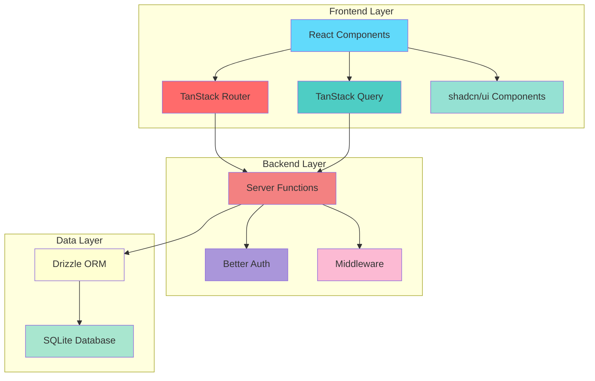
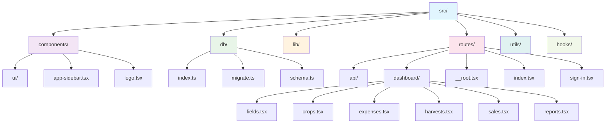
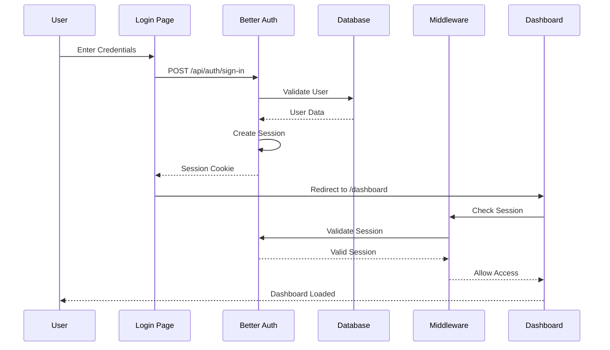
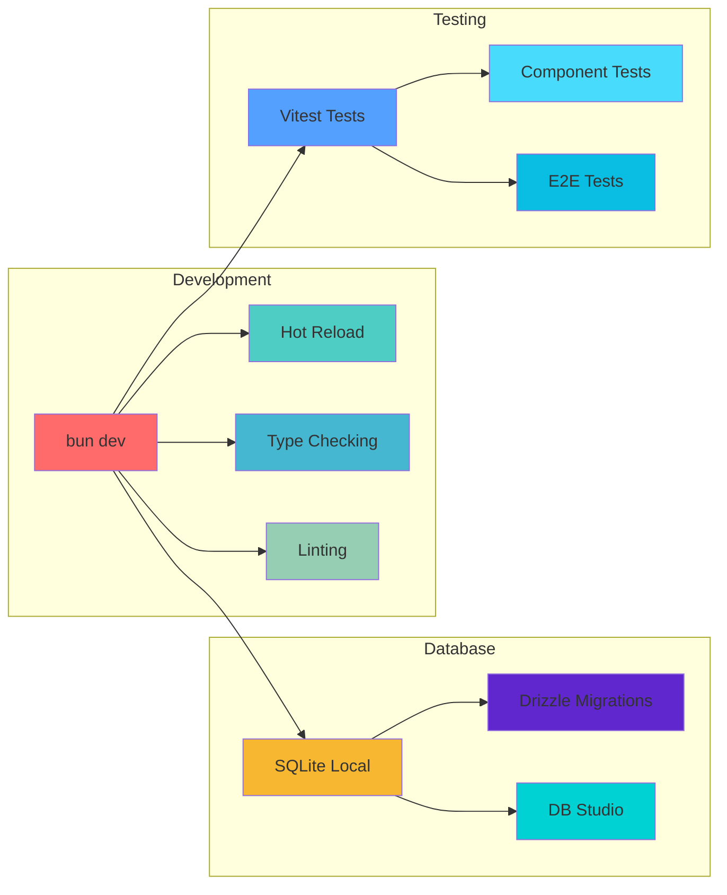

# Farm Assist - Comprehensive Technical Analysis

## 1. Project Overview and Purpose

**Farm Assist** is a Progressive Web App (PWA) designed specifically for smallholder farmers to manage farm record keeping and expense tracking. The system enables farmers to track expenses, harvests, sales, and calculate profits in a centralized, mobile-friendly application.

### Key Features:

- 📊 Dashboard with financial overview
- 🗺️ Field management and mapping
- 🌾 Crop tracking and planning
- 💸 Expense categorization and tracking
- 📦 Harvest logging and yield management
- 💰 Sales tracking and revenue management
- 📈 Financial reporting and profit analysis
- 📱 PWA capabilities for mobile installation

## 2. Technology Stack

### Frontend:

- **React 19.2.1** - Core UI framework
- **TanStack Router 1.140.1** - File-based routing with Sever Side Rendering support
- **TanStack Query 5.90.12** - Data fetching and caching
- **TanStack Start 1.140.2** - Full-stack React framework
- **Tailwind CSS 4.1.17** - Utility-first styling
- **shadcn/ui** - Component library built on Radix UI
- **Lucide React** - Icon library

### Backend:

- **TanStack Start** - Server-side rendering and API routes
- **Drizzle ORM 0.39.3** - Database ORM
- **Better Auth 1.4.6** - Authentication system

### Database:

- **SQLite (libSQL)** - Local database with @libsql/client
- **Drizzle Kit** - Database migrations and management

### Development & Runtime:

- **Bun** - JavaScript runtime and package manager
- **Vite 7.2.7** - Build tool and dev server
- **TypeScript 5.9.3** - Type safety
- **Vitest** - Testing framework

## 3. Architecture and Design Patterns

### Full-Stack Architecture:

The application uses **TanStack Start** for a unified full-stack React architecture with:

- **File-based routing** with automatic route tree generation
- **Server functions** for API endpoints
- **Server-side rendering (SSR)** with hydration
- **Streaming** support for optimal performance

### System Architecture Flow:



### Design Patterns:

1. **Repository Pattern**: Database operations abstracted through utility functions
2. **Query Options Pattern**: TanStack Query for consistent data fetching
3. **Component Composition**: Modular UI components with shadcn/ui
4. **Server Functions**: API endpoints as typed server functions
5. **Middleware Pattern**: Authentication and request processing

### Project Structure:



## 4. Database Schema and Data Models

### Authentication Tables (Better Auth):

- **users**: User profiles with email verification
- **sessions**: Active user sessions
- **accounts**: OAuth provider accounts
- **verifications**: Email/phone verification tokens

### Farm Management Tables:

#### Fields:

```sql
- id (PK)
- userId (FK)
- name
- areaHa (hectares)
- location
- season
- notes
- timestamps
```

#### Crops:

```sql
- id (PK)
- fieldId (FK)
- name
- variety
- season
- plantingDate
- expectedHarvestDate
- notes
- timestamps
```

#### Activities:

```sql
- id (PK)
- cropId (FK)
- type
- performedOn
- laborHours
- notes
- season
- timestamps
```

#### Expenses:

```sql
- id (PK)
- cropId (FK, optional)
- fieldId (FK, optional)
- category (Seeds, Fertilizer, Labor, etc.)
- item
- quantity
- unit
- costPerUnit
- totalCost
- purchasedOn
- season
- notes
- timestamps
```

#### Harvests:

```sql
- id (PK)
- cropId (FK)
- harvestedOn
- quantity
- unit
- qualityGrade
- season
- notes
- timestamps
```

#### Sales:

```sql
- id (PK)
- harvestId (FK)
- soldOn
- buyer
- quantity
- unit
- pricePerUnit
- totalAmount
- season
- notes
- timestamps
```

## 5. API Endpoints and Routes

### Route Architecture:

```mermaid
graph TD
    subgraph "Public Routes"
        A[/ - Landing Page]
        B[/sign-in - Authentication]
    end

    subgraph "API Routes"
        C[/api/auth/* - Better Auth Handler]
    end

    subgraph "Protected Dashboard Routes"
        D[/dashboard - Main Dashboard]
        E[/dashboard/fields - Field Management]
        F[/dashboard/crops - Crop Tracking]
        G[/dashboard/expenses - Expense Management]
        H[/dashboard/harvests - Harvest Logging]
        I[/dashboard/sales - Sales Tracking]
        J[/dashboard/reports - Financial Reports]
    end

    A --> B
    B --> D
    D --> E
    D --> F
    D --> G
    D --> H
    D --> I
    D --> J

    style A fill:#4caf50
    style B fill:#2196f3
    style C fill:#ff9800
    style D fill:#9c27b0
    style E fill:#f44336
    style F fill:#009688
    style G fill:#795548
    style H fill:#607d8b
    style I fill:#e91e63
    style J fill:#3f51b5
```

### Authentication Routes:

- `POST/GET /api/auth/*` - Better Auth handler for sign-in, sign-up, sessions

### Dashboard Routes (Protected):

- `/dashboard` - Main dashboard with statistics
- `/dashboard/fields` - Field management
- `/dashboard/crops` - Crop tracking
- `/dashboard/expenses` - Expense management
- `/dashboard/harvests` - Harvest logging
- `/dashboard/sales` - Sales tracking
- `/dashboard/reports` - Financial reports

### Public Routes:

- `/` - Landing page
- `/sign-in` - Authentication page

### Server Functions:

- `getStats()` - Dashboard statistics
- `getFields()`, `addField()`, `deleteField()` - Field CRUD
- `getExpenses()`, `addExpense()`, `deleteExpense()` - Expense CRUD
- `getReportData()` - Financial reporting data

## 6. Authentication and Authorization

### Authentication Flow:



### Better Auth Implementation:

- **Email/Password authentication** with session management
- **Drizzle adapter** for database integration
- **TanStack Start cookies** plugin for SSR compatibility
- **Middleware protection** for dashboard routes

### Security Features:

- Session-based authentication
- Email verification support
- Protected route middleware
- CSRF protection through Better Auth

### User Flow:

1. Sign up/Sign in via `/sign-in`
2. Session creation with secure cookies
3. Redirect to dashboard
4. Middleware validates session on protected routes
5. Sign out clears session and redirects

## 7. Frontend Components and UI Structure

### Component Architecture:

- **shadcn/ui** components with Radix UI primitives
- **Custom sidebar** with mobile responsiveness
- **Form components** with validation
- **Data tables** for expense/sales listing
- **Dialog components** for create/edit operations

### Key UI Components:

- **AppSidebar**: Navigation with active state indicators
- **Dashboard Cards**: Statistics display with icons
- **Expense Table**: Categorized expense listing
- **Reports Layout**: Financial summaries and charts
- **Forms**: Validated input forms for all entities

### Responsive Design:

- Mobile-first approach with Tailwind CSS
- Collapsible sidebar for mobile
- Touch-friendly interface elements
- PWA manifest for app-like experience

## 8. Development and Deployment Setup

### Development Workflow:



### Development Commands:

```bash
bun dev          # Start development server
bun build        # Build for production
bun db:migrate   # Run database migrations
bun db:studio    # Database management UI
bun test         # Run tests
```

### Database Management:

- **Drizzle migrations** with version control
- **SQLite database** with file-based storage
- **Environment variables** for database URL
- **Migration scripts** for schema updates

### Production Deployment Architecture:

```mermaid
graph TB
    subgraph "Docker Container"
        A[Bun Runtime]
        B[Production Server]
        C[SQLite Database]
        D[Asset Optimization]
    end

    subgraph "Infrastructure"
        E[Reverse Proxy]
        F[SSL/TLS]
        G[Monitoring]
        H[Backups]
    end

    subgraph "CI/CD Pipeline"
        I[Build Stage]
        J[Test Stage]
        K[Deploy Stage]
    end

    I --> J
    J --> K
    K --> A
    A --> B
    A --> C
    B --> D
    B --> E
    E --> F
    A --> G
    C --> H

    style A fill:#e74c3c
    style B fill:#3498db
    style C fill:#2ecc71
    style D fill:#f39c12
    style E fill:#9b59b6
    style F fill:#1abc9c
    style G fill:#e67e22
    style H fill:#34495e
```



### Docker Configuration:

```dockerfile
FROM oven/bun:1
WORKDIR /app
COPY package.json bun.lock* ./
RUN bun install --frozen-lockfile
COPY . .
RUN bun run build
RUN mkdir -p /data
ENV NODE_ENV=production
ENV DATABASE_URL=file:/data/data.db
EXPOSE 3000
CMD bun run db:migrate && bun run server.ts
```

### Database Management:

- **Drizzle migrations** with version control
- **SQLite database** with file-based storage
- **Environment variables** for database URL
- **Migration scripts** for schema updates

### Production Deployment:

- **Dockerfile** with multi-stage build
- **Bun runtime** for optimal performance
- **Production server** with intelligent asset loading
- **Environment configuration** for database and auth

### Docker Configuration:

```dockerfile
FROM oven/bun:1
WORKDIR /app
COPY package.json bun.lock* ./
RUN bun install --frozen-lockfile
COPY . .
RUN bun run build
RUN mkdir -p /data
ENV NODE_ENV=production
ENV DATABASE_URL=file:/data/data.db
EXPOSE 3000
CMD bun run db:migrate && bun run server.ts
```

## 9. Key Technical Features

### Performance Optimizations:

- **Intelligent asset preloading** with configurable memory management
- **Gzip compression** for static assets
- **ETag support** for browser caching
- **Code splitting** with TanStack Router
- **Suspense boundaries** for loading states

### PWA Features:

- **Service Worker** registration
- **Offline capabilities** through caching
- **App manifest** for mobile installation
- **Responsive design** for all screen sizes

### Data Management:

- **Optimistic updates** with TanStack Query
- **Automatic cache invalidation** on mutations
- **Server-side data fetching** with SSR
- **Type-safe API calls** through server functions

### Error Handling:

- **Global error boundaries**
- **Toast notifications** for user feedback
- **Form validation** with error states
- **Network error handling** with retry logic

## 10. Security Considerations

- **Session-based authentication** with secure cookies
- **SQL injection prevention** through Drizzle ORM
- **XSS protection** with React's built-in sanitization
- **CSRF protection** via Better Auth
- **Environment variable management** for sensitive data

## 11. File Locations and Key Files

### Configuration Files:

- `package.json` - Dependencies and scripts
- `tsconfig.json` - TypeScript configuration
- `vite.config.ts` - Build configuration with PWA setup
- `drizzle.config.ts` - Database configuration
- `Dockerfile` - Production deployment

### Core Application Files:

- `src/routes/__root.tsx` - Root layout and meta tags
- `src/router.tsx` - Router configuration with TanStack Query
- `src/lib/auth.ts` - Authentication setup
- `src/db/schema.ts` - Database schema definition
- `src/db/index.ts` - Database connection

### Feature Components:

- `src/components/app-sidebar.tsx` - Main navigation
- `src/routes/dashboard/index.tsx` - Dashboard overview
- `src/routes/dashboard/fields.tsx` - Field management
- `src/routes/dashboard/expenses.tsx` - Expense tracking
- `src/routes/dashboard/reports.tsx` - Financial reports

### Utility Functions:

- `src/utils/dashboard.ts` - Dashboard statistics
- `src/utils/fields.ts` - Field CRUD operations
- `src/utils/expenses.ts` - Expense management
- `src/utils/reports.ts` - Financial reporting
- `src/utils/format.ts` - Data formatting utilities

### Server Configuration:

- `server.ts` - Production server with asset optimization
- `src/middleware/auth.ts` - Authentication middleware
- `src/routes/api/auth/$.ts` - Auth API handler

This Farm Assist application represents a modern, full-stack React application with excellent developer experience, type safety, and production-ready features specifically tailored for smallholder farming operations.
